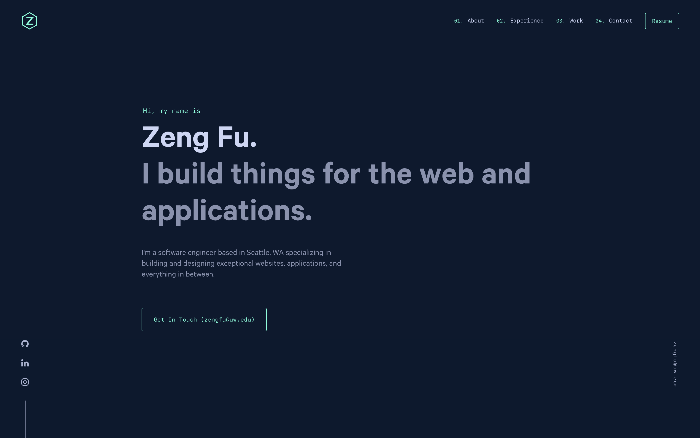

  

<h1 align="center">
  xZengFux.com - v1
</h1>

  The First iteration of <a href="https://xZengFux.com" target="_blank">xZengFux.com</a> built with <a href="https://www.gatsbyjs.org/" target="_blank">Gatsby</a> and hosted with <a href="https://www.netlify.com/" target="_blank">Netlify</a>

Inspired by <a href="https://brittanychiang.com" target="_blank">Brittany Chiang</a> 

## 🎨 Color Reference

| Color          | Hex                                                                |
| -------------- | ------------------------------------------------------------------ |
| Navy           |  `#0a192f` |
| Light Navy     |  `#172a45` |
| Lightest Navy  |  `#303C55` |
| Slate          |  `#8892b0` |
| Light Slate    |  `#a8b2d1` |
| Lightest Slate |  `#ccd6f6` |
| White          |  `#e6f1ff` |
| Green          |  `#64ffda` |
